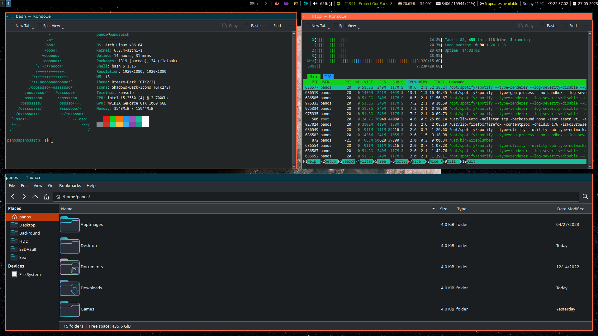

# **dot.config Files**
Use them as you please.

## i3
(i3blocks, rofi, thunar)

### Installation
1. Clone repo
`git clone https://github.com/defykouren/dot.configs.git`

2. Change directory to the repo
`cd ~/dot.config/i3/`

3. Make the install script executable
`chmod +x install.sh`

4. Install
`./install.sh`
